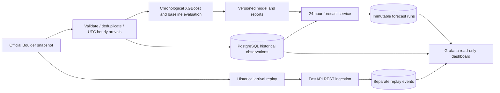

# Architecture

Python runs on Windows; Docker hosts PostgreSQL and Grafana. Grafana is the primary frontend. Training stays offline. Replay never modifies historical aggregates. Timestamps are stored in UTC and displayed in America/Denver. Dataset hashes, model versions, training cutoffs and separate forecast IDs preserve provenance.
