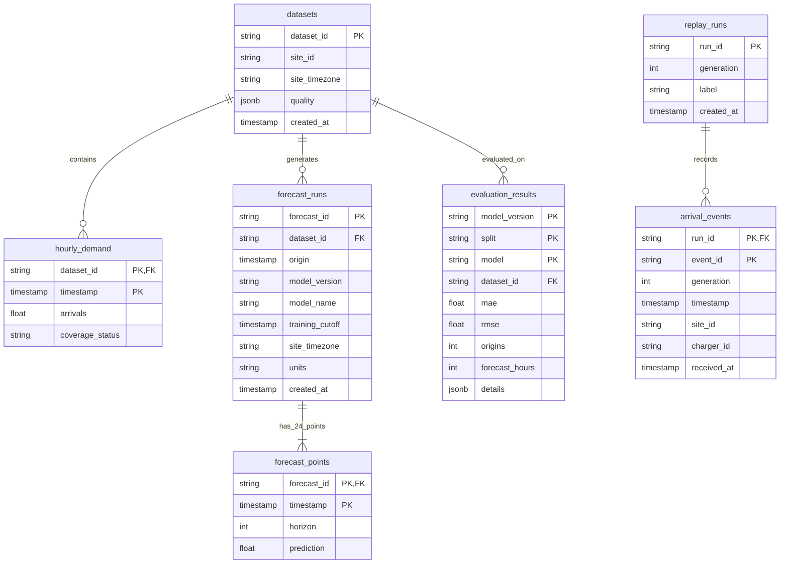

# Detailed Design Document

## 1. Database Entity-Relationship (ER) Design



---

## 2. Mathematical Formulations & Feature Engineering

### 2.1 Cyclical Diurnal Time Encoding
To represent the continuous cyclical progression of hours across midnight without creating an artificial numerical discontinuity between 23:00 and 00:00, cyclical trigonometric transforms are computed:

$$\text{hour\_sin} = \sin\left(\frac{2\pi \cdot h_{\text{local}}}{24}\right), \quad \text{hour\_cos} = \cos\left(\frac{2\pi \cdot h_{\text{local}}}{24}\right)$$

where $h_{\text{local}} \in \{0, 1, \dots, 23\}$.

### 2.2 Time-Series Lags & Rolling Statistics
At any forecast origin $t$, feature vectors leverage non-leaking past arrival counts:
* **Lag Terms**:
  $$\text{lag}_1 = y_{t-1}, \quad \text{lag}_{24} = y_{t-24}, \quad \text{lag}_{168} = y_{t-168}$$
* **Shifted Rolling Window Statistics**:
  $$\mu_{24}(t) = \frac{1}{24}\sum_{i=1}^{24} y_{t-i}, \quad \sigma_{24}(t) = \sqrt{\frac{1}{24}\sum_{i=1}^{24} (y_{t-i} - \mu_{24}(t))^2}$$
  $$\mu_{168}(t) = \frac{1}{168}\sum_{i=1}^{168} y_{t-i}, \quad \sigma_{168}(t) = \sqrt{\frac{1}{168}\sum_{i=1}^{168} (y_{t-i} - \mu_{168}(t))^2}$$

All rolling operations are strictly shifted by 1 hour to prevent lookahead leakage into time $t$.

---

## 3. Machine Learning Algorithms & Benchmark Formulations

### 3.1 XGBoost Regressor (Primary Model)
* **Objective Function**: Root Mean Squared Error regression objective:
  $$\mathcal{L}_{\text{XGB}} = \sum_{i=1}^{N} (y_i - \hat{y}_i)^2 + \sum_{k=1}^{K} \Omega(f_k)$$
  where $\Omega(f_k) = \gamma T + \frac{1}{2}\lambda \sum_{j=1}^{T} w_j^2$ penalizes tree complexity and leaf weights.
* **Hyperparameter Grid**:
  * `n_estimators`: $\{100, 160\}$
  * `max_depth`: $\{2, 3\}$
  * `learning_rate`: $0.05$
  * `min_child_weight`: $5$
  * `reg_lambda`: $5$
* **Validation Selection**: Evaluated on 30 chronological validation origins. The model configuration achieving the lowest validation MAE is selected and refitted on combined training + validation data before evaluation on the frozen test set.

### 3.2 Random Forest Benchmark
* Retained as a non-boosting ensemble benchmark.
* Configured with 120 trees, `min_samples_leaf=10`, and deterministic random seed ($42$).

### 3.3 Heuristic Seasonal Baselines
* **Same Hour Last Week**:
  $$\hat{y}_{t+h}^{\text{SHLW}} = y_{t+h-168}$$
* **Hour of Week Average**:
  $$\hat{y}_{t+h}^{\text{HOWA}} = \frac{1}{|S_{\text{dow}, h}|}\sum_{\tau \in S_{\text{dow}, h}} y_\tau$$
  where $S_{\text{dow}, h}$ represents all historical observations sharing the exact same day-of-week and hour-of-day.

### 3.4 Evaluation Metrics
Evaluations are computed over $N = 720$ matching test hours across 30 identical chronological forecast origins:
* **Mean Absolute Error (MAE)**:
  $$\text{MAE} = \frac{1}{N}\sum_{i=1}^{N} |y_i - \hat{y}_i| \quad (\text{sessions/hour})$$
* **Root Mean Squared Error (RMSE)**:
  $$\text{RMSE} = \sqrt{\frac{1}{N}\sum_{i=1}^{N} (y_i - \hat{y}_i)^2} \quad (\text{sessions/hour})$$

---

## 4. REST API Endpoint Specifications

### 4.1 Ingest Arrival Event
* **Endpoint**: `POST /replay-runs/{run_id}/events`
* **Request Schema**:
  ```json
  {
    "event_id": "boulder-147654",
    "timestamp": "2023-10-31T06:14:00Z",
    "site_id": "boulder-carpenter-park",
    "charger_id": "boulder-station-01",
    "generation": 1
  }
  ```
* **Response (HTTP 200)**:
  ```json
  {
    "accepted": true,
    "duplicate": false,
    "event_id": "boulder-147654",
    "run_id": "demo",
    "generation": 1
  }
  ```
* **Error States**:
  * `422 Unprocessable Entity`: `site_id` does not match configured site, or timestamp is not timezone-aware.
  * `409 Conflict`: Event already exists with different arrival attributes, or generation mismatch.

### 4.2 Create 24-Hour Forecast
* **Endpoint**: `POST /forecasts`
* **Request Schema**:
  ```json
  {
    "origin": "2023-10-31T06:00:00Z"
  }
  ```
* **Validation Rule**: Origin must fall on an exact hourly boundary (`minute == second == microsecond == 0`) and must be $\ge$ the training cutoff timestamp.
* **Response (HTTP 201)**:
  ```json
  {
    "forecast_id": "ac5bf871-e3bb-43bc-bfce-20455a1b5d5a",
    "origin": "2023-10-31T06:00:00Z",
    "model_name": "xgboost",
    "model_version": "xgb-007fa5a4ccf4a14bec33",
    "units": "sessions/hour",
    "expected_total_arrivals": 18.42,
    "busiest_hour": "2023-10-31T15:00:00Z",
    "points": [
      {"timestamp": "2023-10-31T07:00:00Z", "horizon": 1, "prediction": 0.45},
      {"timestamp": "2023-10-31T08:00:00Z", "horizon": 2, "prediction": 1.12}
    ]
  }
  ```
