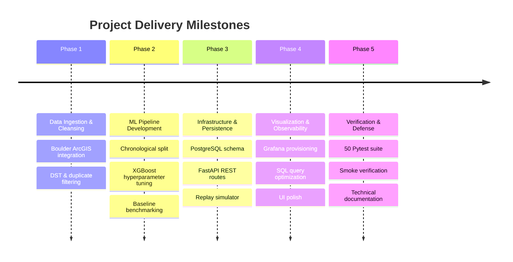

# Project Charter

## 1. Project Title
**IoT-Based EV Charging Demand Forecasting**

---

## 2. Executive Summary
The rapid adoption of Electric Vehicles (EVs) introduces substantial localized volatility to electrical grids and public charging infrastructure. Effective planning requires operators to anticipate arrival congestion before stations experience saturation. 

This project delivers an end-to-end, production-grade prototype for site-level EV charging session arrival forecasting. Using empirical municipal IoT transaction data, machine learning pipelines (XGBoost), a RESTful API layer (FastAPI), immutable time-series persistence (PostgreSQL), and an executive visualization interface (Grafana), the platform forecasts charging session arrivals 24 hours into the future on an hourly resolution.

---

## 3. Project Objectives & Scope

### 3.1 Primary Objectives
1. **Accurate Arrival Forecasting**: Predict hourly charging session arrivals ($\text{sessions/hour}$) across a rolling 24-hour horizon using state-of-the-art gradient-boosted decision trees (XGBoost).
2. **IoT Ingestion Simulation**: Implement an idempotent, chronological REST ingestion pipeline that emulates real-time edge charging telemetry.
3. **Enterprise Visualization**: Provide a secure, read-only operational dashboard in Grafana to visualize historical patterns, forecasts, data quality, and live telemetry.
4. **Leakage-Safe Architecture**: Enforce strict chronological time-series splitting, feature lag calculation, and frozen model artifacts preventing data lookahead leakage.

### 3.2 In-Scope
* Ingestion and preprocessing of official City of Boulder Open Data EV charging transaction logs (148,136 raw events).
* Site selection focused on Scott Carpenter Park (1505 30th St, Boulder, CO) for December 1, 2022 to December 1, 2023.
* Automated feature extraction (cyclical diurnal/weekly encodings, recursive lags at 1h, 24h, 168h, rolling statistics).
* Automated training, hyperparameter grid search, and validation refitting for XGBoost alongside Random Forest and historical baseline benchmarks.
* Containerized PostgreSQL database with strict role-based access control (`ev_app` read-write, `grafana_reader` read-only).
* Containerized Grafana service with automated datasource and dashboard provisioning.
* FastAPI service with endpoints for health checks, historical queries, model metadata, forecast generation, and replay control.
* Comprehensive test suite verifying data transformations, model invariants, API contracts, and database integrity.

### 3.3 Out-of-Scope
* Electrical power/grid load prediction (kWh, peak instantaneous kW, or voltage sag).
* Waiting time, queue length, charger occupancy, or connector hardware fault monitoring.
* Physical hardware deployment of microcontrollers or live OCPP connectors on campus.
* Cloud proprietary vendor locking; the architecture must run on self-contained, local Docker infrastructure.

---

## 4. Stakeholders & Roles

| Role | Stakeholder | Responsibilities |
|---|---|---|
| **Project Sponsor / Evaluator** | Academic Faculty / Viva Committee | Evaluates academic rigour, engineering standards, architecture soundness, and viva defense. |
| **Lead Engineer** | Student / Developer | System architecture, ML modeling, backend engineering, containerization, and documentation. |
| **Target User: Station Operator** | Infrastructure Planner | Uses Grafana demand intelligence to schedule charger maintenance and dynamic pricing. |
| **Target User: Grid Utility** | Distribution System Operator | Leverages 24-hour arrival forecasts to anticipate feeder loading and peak substation stress. |

---

## 5. Technology Stack & Governance

| Layer | Technology | Specification / Version | Rationale |
|---|---|---|---|
| **Programming Language** | Python | 3.11 – 3.13 | Native support for scientific computing and async servers. |
| **Machine Learning** | XGBoost & Scikit-Learn | `xgboost==3.0.5`, `scikit-learn==1.7.2` | High-performance gradient boosting optimized for tabular time-series regression. |
| **Backend REST API** | FastAPI & Uvicorn | `fastapi==0.139.0`, `uvicorn==0.49.0` | High-concurrency async web framework with automatic OpenAPI documentation. |
| **Database & ORM** | PostgreSQL & SQLAlchemy | PostgreSQL 16 Alpine, `sqlalchemy==2.0.43` | ACID-compliant relational storage with dialect-specific idempotent upserts. |
| **Dashboard & UI** | Grafana | Grafana 12.2.0 | Industry-standard observability platform provisioned via declarative YAML/JSON. |
| **Containerization** | Docker & Docker Compose | Docker Engine 29+, Compose v2 | Isolated multi-container deployment reproducible across OS environments. |

---

## 6. Project Milestones & Timeline

---

## 7. Key Assumptions & Constraints
* **Historical Observation Window**: Dataset represents observed municipal behavior from December 2022 to November 2023 in Boulder, CO (`America/Denver` timezone); it does not represent present-day live California or Indian campus patterns without local recalibration.
* **Coverage Assumption**: Silence intervals under 168 hours without recorded transactions are treated as zero arrivals rather than equipment failure unless verified missing.
* **Deterministic Offline Training**: Model training is strictly offline; HTTP inference calls never trigger model fitting or heavy parameter retraining.
