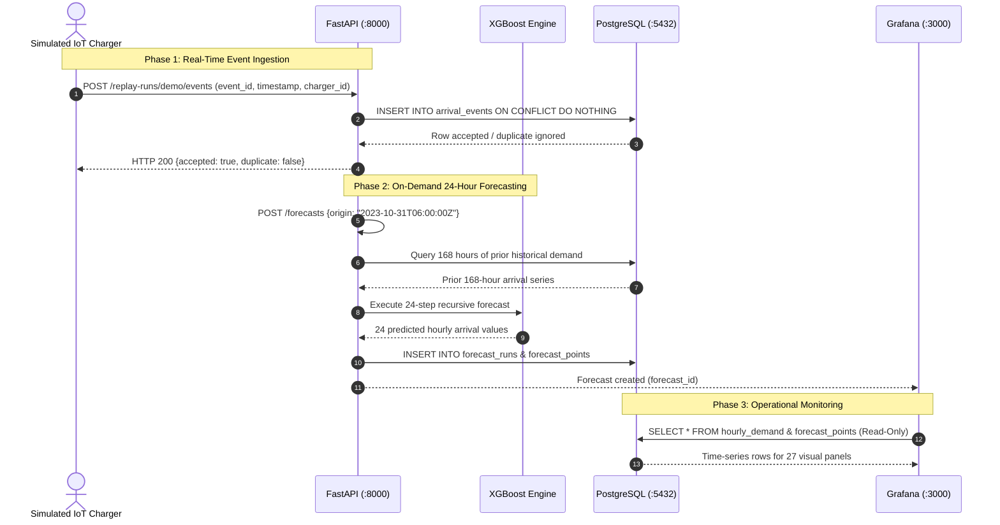

# System Architecture Document

## 1. High-Level System Architecture

The EV Charging Demand Forecasting platform is structured as an event-driven, decoupled microservice architecture. It cleanly separates **offline analytical modeling** from **online low-latency serving and monitoring**.

```mermaid
flowchart TD
    subgraph Data Sources
        RAW[("Boulder Open Data\n(148,136 raw events)")]
    end

    subgraph Offline ML Pipeline
        PRE[("evforecast.boulder\nClean & Aggregate")]
        FEAT["Feature Engineering\n(Lags, Cycles, Rolling Stats)"]
        TRAIN["XGBoost / RF Training\nChronological Validation"]
        ARTIFACT[("Native Artifacts\nxgboost.ubj + schema")]
        PRE --> FEAT --> TRAIN --> ARTIFACT
    end

    subgraph Online Serving & Ingestion Layer
        API["FastAPI Backend\n(:8000)"]
        SVC["Forecast Service\n(Recursive 24h Engine)"]
        STORE["SQLAlchemy Store\n(Dialect-aware Ingestion)"]
        API --> SVC
        API --> STORE
        ARTIFACT -.->|Read at Startup| SVC
    end

    subgraph IoT Emulation Layer
        REPLAY["Simulated IoT Feed\n(evforecast.replay_http)"]
        REPLAY -->|POST /replay-runs/events| API
    end

    subgraph Storage & Observability
        PG[("PostgreSQL 16 Engine\n(:5432)")]
        GRAFANA["Grafana 12.2 Dashboard\n(:3000)"]
        STORE -->|Read / Write (ev_app)| PG
        PG -->|Read-Only (grafana_reader)| GRAFANA
    end

    RAW --> PRE
```

---

## 2. Component & Subsystem Breakdown

### 2.1 Data Preprocessing Subsystem (`evforecast/boulder.py`)
* **Source Validation**: Audits raw JSON snapshot SHA-256 against recorded cryptographic manifests.
* **Timestamp Normalization**: Resolves mixed datetime formats (`%m/%d/%Y %H:%M` and ISO) to UTC while strictly accounting for `America/Denver` daylight saving transitions (MST/MDT).
* **Deduplication Engine**: Employs two-stage deduplication:
  1. Primary key uniqueness by `ObjectId2`.
  2. Exact payload hash matching across plug-in, plug-out, duration, and energy fields.
* **Hourly Aggregation**: Bins discrete transactions into hourly arrival rates and applies a 168-hour silence threshold to detect feed outages.

### 2.2 Machine Learning & Recursive Forecasting Subsystem (`evforecast/models.py`)
* **Recursive Horizon Algorithm**: Projects session arrivals $h = 1 \dots 24$ steps ahead. At step $h=1$, true past observations populate lags $t-1, t-24, t-168$. For $h > 1$, missing future lag terms are filled recursively with previous predictions:
  $$\hat{y}_{t+h} = f\left(\hat{y}_{t+h-1}, \dots, y_{t}, \mathbf{x}_{t+h}^{\text{calendar}}\right)$$
* **Leakage-Safe Features**: Cyclical hour sine/cosine transforms, day-of-week one-hot indicators, weekend flags, and shifted rolling means/standard deviations calculated strictly from historical intervals.
* **Model Serialization**: Models are saved in native XGBoost Universal Binary JSON (`xgboost.ubj`) format, accompanied by an immutable cryptographic checksum and feature manifest (`schema.json`).

### 2.3 REST API Service (`evforecast/api.py`)
* Built with asynchronous FastAPI and Uvicorn.
* **Lifespan Management**: Initializes database connection pools and loads native model artifacts once on startup into application state.
* **Contract Validation**: Enforces Pydantic V2 models with strict type enforcement (`extra="forbid"`).
* **Fault Isolation**: Traps database disconnection errors and returns structured HTTP 503 responses without worker crashes.

### 2.4 Database & Persistence Layer (`evforecast/database.py`)
* Relational schema backed by PostgreSQL 16 (with SQLite support for unit testing).
* **Schema Design**:
  * `datasets`: Metadata, total local days, assumed zero hours, and data quality warnings.
  * `hourly_demand`: Time-series table of historical arrivals per hour with coverage status.
  * `replay_runs`: Replay run tracking with generation identifiers for safe resets.
  * `arrival_events`: Telemetry events ingested from the IoT feed.
  * `forecast_runs`: Immutable forecast run headers recording model version, origin, and training cutoff.
  * `forecast_points`: Exact 24 hourly predictions per forecast run.
  * `evaluation_results`: Validation and test split evaluation metrics (MAE, RMSE).
* **Dialect-Aware Idempotency**: Leverages `ON CONFLICT DO NOTHING` to ensure replaying identical telemetry events never causes double-counting or primary key violations.

### 2.5 Security & Role-Based Access Control (RBAC)
Database isolation is enforced at the network and PostgreSQL user permission level:

```
┌────────────────────────────────────────────────────────┐
│               PostgreSQL Database Security              │
└────────────────────────────────────────────────────────┘
                           │
       ┌───────────────────┴───────────────────┐
       ▼                                       ▼
User: ev_app                            User: grafana_reader
• Used by: FastAPI Backend              • Used by: Grafana Dashboard
• Permissions: SELECT, INSERT, UPDATE   • Permissions: SELECT only
• Scope: Full application state         • Scope: Cannot alter or delete data
```

---

## 3. Data Flow Diagram (DFD Level 1)



---

## 4. Network Topology & Container Port Mappings

All external access is strictly bound to local loopback (`127.0.0.1`) to prevent unauthorized network exposure:

| Container / Service | Internal Port | Host Binding | Protocol | Purpose |
|---|---|---|---|---|
| `evforecast-postgres-1` | `5432` | `127.0.0.1:5432` | TCP / PostgreSQL | Relational database storage |
| `evforecast-grafana-1` | `3000` | `127.0.0.1:3000` | HTTP | Executive visualization dashboard |
| `FastAPI / Uvicorn` | `8000` | `127.0.0.1:8000` | HTTP | Ingestion and prediction REST API |
